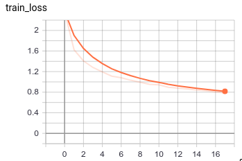
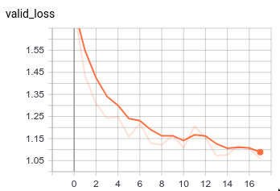
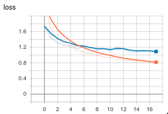
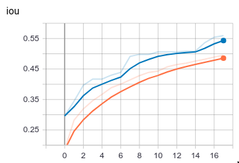
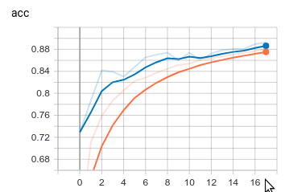

# Merge tensorboard scalars

This is a simple example that takes a tensorflow event file as input and extract wish-to-plot scalars (e.g., train_loss, val_loss) and merge them to plot. Hope this helps someone may need.

# Dependencies
* Tensorflow and tensorboard 1.x (mine is 1.15 but 1.xx should be fine. TODO 2.x??)

Assuming that you have these two plots that you want to merge.

 

```sh
$git clone https://github.com/inkyusa/merge_tensorboard_scalars.git
$cd merge_tensorboard_scalars
$python ./merge_plot.py ./logs/events.out.tfevents.1611226552.superCom
```
This will generate `tb_merged` folder under `logs` folder. To visualise it, simply run the following command.

```shell
$tensorboard --logdir=logs/tb_merged
```
This will inform you to where connect to see the results (my case, `http://myCom:6006`). You can type this onto your browser.

You then should be able to see the figures shown below.

  
